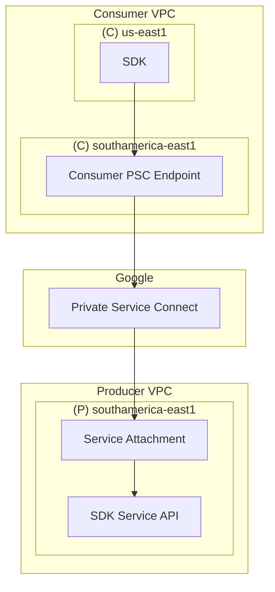

# Cross Regional Google Private Service Connect POC

A proof of concept project to show how to setup a Private Service Connect across different regions to keep network traffic private and secure.

## Approach

To privately connect to a service running in another region, Google's Private Service Connect can be used.

## Solution Diagram

## POC Result

This POC proves that access can be acquired in a secure manner to a service running in a different region than the consumer's region. The major downside to the solution is that the consumer VPC must have the PSC endpoint created in the same region as the producer service. Inter-region traffic can really only happen on the consumer side (i.e. us-east1 to southamerica-east1). Once traffic hits the PSC endpoint on the consumer side, a forwarding rule will forward traffic to the target service attachment on the producer side.

## Deployment & Testing

1. Apply infrastructure in the following order:
   1. `producer-service`
   2. `consumer-endpoint`
2. Navigate to the Network Services/Load Balacing/Frontends and get the `consumer-endpoint` IP address
3. Navigate to the VM Instances Cloud Console page and SSH into the `test-machine`
4. Use `curl` to hit the `consumer-endpoint` IP address to retrieve the HTML page deployed in the producer project

## Credit

https://github.com/daanheikens/terraform-private-service-connect-examples
https://cloud.google.com/vpc/docs/about-accessing-vpc-hosted-services-endpoints#global-access
